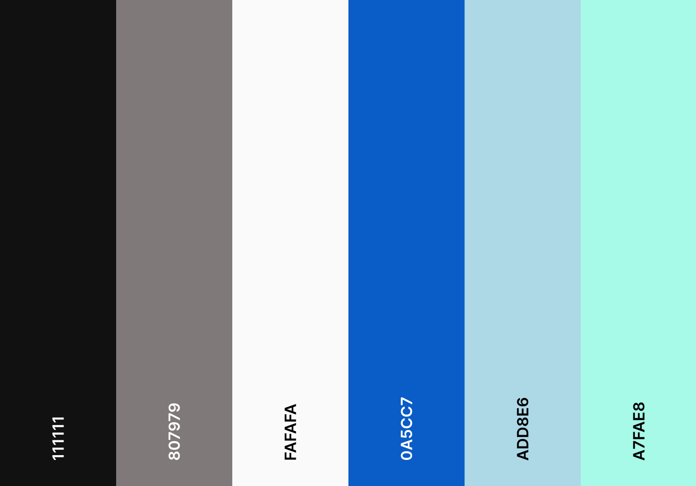
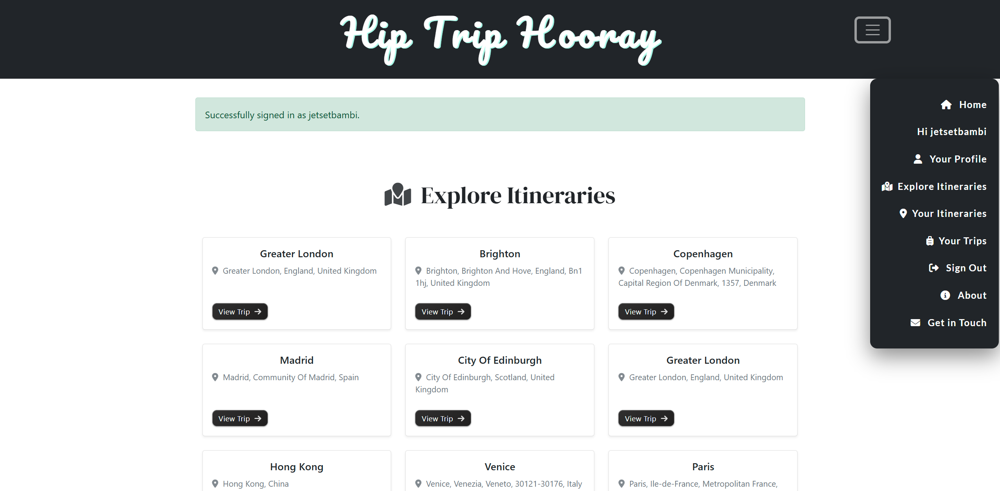
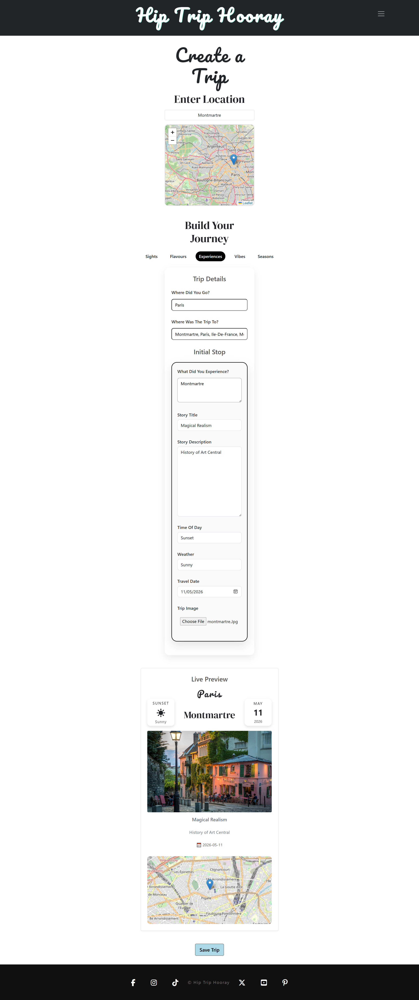
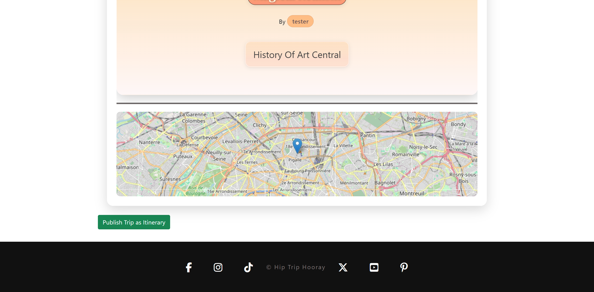
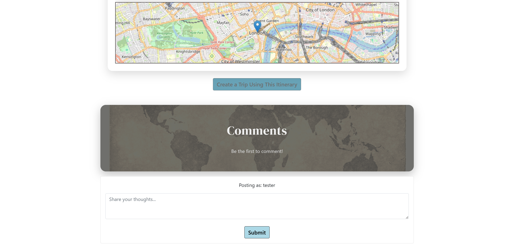
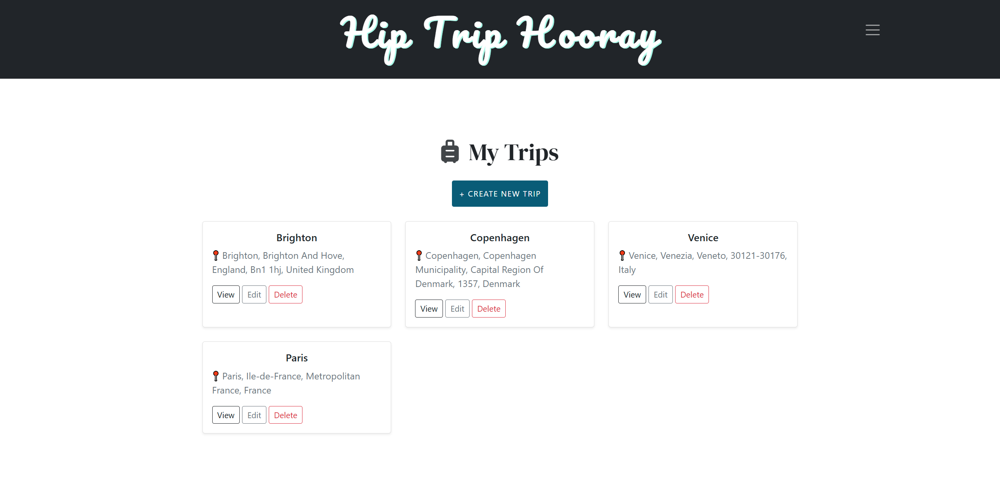
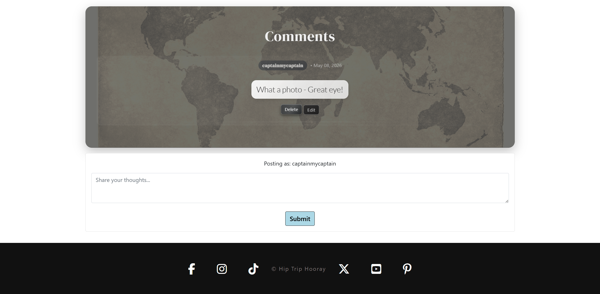
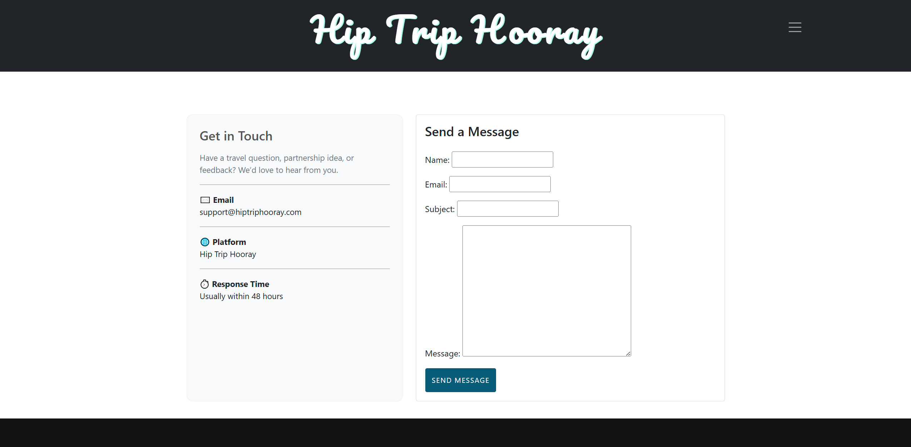
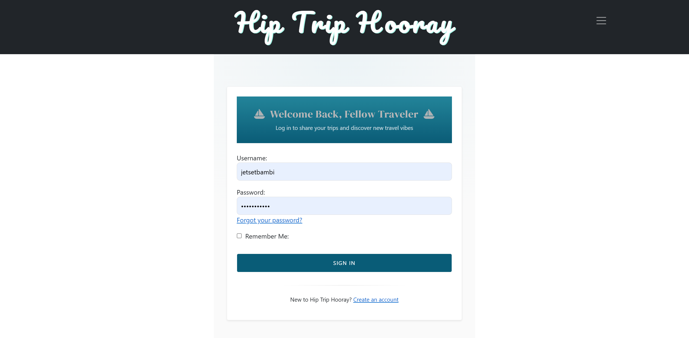

<h1 align="center" bold>Hip Trip Hooray</h1>

<h3 align="center"></h3>

Hip Trip Hooray is your go-to platform for planning, publishing and sharing travel itineraries with the people who matter most.

From seasoned globetrotters documenting their adventures to families planning a first trip abroad together, Hip Trip Hooray is so simple and so intuitive to use, anyone anywhere can start planning and sharing their journeys.

Get started right here: ([Hip Trip Hooray](https://hip-trip-hooray-041d66f48ae3.herokuapp.com/))


# Table of Contents

## Contents

- [User Stories](#user-stories)
    - [Visitor Goals](#visitor-goals)
- [Design](#design)
  + [Colour Scheme](#colour-scheme)
  + [Typography](#typography)
  + [Imagery](#imagery)
  + [Icons](#icons)
- [Structure](#structure)
- [Features](#features)
    + [Current Features](#current-features)
    + [Future Features](#future-features)
- [Wireframes](#wireframes)
- [Technologies](#technologies)
  + [Languages](#languages)
  + [Frameworks Libraries Programs](#frameworks-libraries-programs)
- [Testing](#testing)
- [Testing User Stories](#testing-user-stories)
    - [Testing Visitor Goals](#testing-visitor-goals)
- [Deployment](#deployment)
  + [Heroku](#heroku)
  + [Forking the GitHub Repository](#forking-the-github-repository)
- [Credits](#credits)
  + [Code](#code)
  + [Media](#media)
  + [Content](#content)
  + [Acknowledgements](#acknowledgements)


# User Stories

## Visitor Goals

"**_As a user of Hip Trip Hooray, I would like to** _______________"

:white_check_mark: *successfully implemented*

:x: *not yet implemented*

- :white_check_mark: *an interface layout that can be immediately understood, irrespective of age and nationality, without the need for complicated instructions or a key*.
- :white_check_mark: *register for an account and log in securely*.
- :white_check_mark: *create a trip, filling in details about my destination, the sights I saw, the food I ate, the experiences I had, the vibes I felt and the seasons I travelled in*.
- :white_check_mark: *upload photos to accompany each stop on my trip*.
- :white_check_mark: *add a story title and story description to each stop so I can tell my travel story in my own words*.
- :white_check_mark: *record the date, weather and time of day for each stop*.
- :white_check_mark: *use an interactive map to set a location for my trip and each stop*.
- :white_check_mark: *see a live preview of my trip as I build it*.
- :white_check_mark: *save a trip as a draft before publishing*.
- :white_check_mark: *publish my trip as a public itinerary for others to explore*.
- :white_check_mark: *edit my trip after saving it*.
- :white_check_mark: *delete my trip if I no longer want it*.
- :white_check_mark: *browse a list of published itineraries from other travelers*.
- :white_check_mark: *view a published itinerary in a beautifully presented carousel format, organised by category tabs*.
- :white_check_mark: *use an existing itinerary as a template to plan my own trip to the same destination*.
- :white_check_mark: *leave comments on itineraries I enjoy*.
- :white_check_mark: *edit and delete my own comments*.
- :white_check_mark: *see a country flag displayed alongside each itinerary*.
- :white_check_mark: *view mini maps showing the location of each stop within an itinerary*.
- :white_check_mark: *use the site on any device — mobile, tablet or desktop*.
- :white_check_mark: *get in touch with the Hip Trip Hooray team via a contact form*.

- :x: *follow other travelers and get notified when they publish new itineraries*.
- :x: *add video content (vlogs) to my trip stops*.
- :x: *choose from beautifully crafted templates when building my trip*.
- :x: *add more than one stop per category tab*.
- :x: *receive AI-generated travel suggestions based on my destination*.
- :x: *buddy up with fellow travelers looking to do similar itineraries*.
- :x: *book accommodation or tours directly from an itinerary*.


# Design

-   ## Colour Scheme

    -   The color palette for Hip Trip Hooray draws on calm, earthy, travel-inspired tones — sepia greys, warm whites, deep charcoals and a range of blues — designed to evoke the minimalist feeling of a well-worn travel journal. The palette is clean and sophisticated, letting the user's own photos and stories take do the story-telling.

    <h3 align="center"></h3>


-   ## Typography

    -   The typography for Hip Trip Hooray is chosen to feel playful, sophisticated yet slightly adventurous — think 1980s Miami Vice vibes meets classic Vogue Travel. 

    1) **Title Font**

         -   The title font, Pacifico, is used for all major headings, the logo and key branding elements, giving the site its distinctive personality.

        <h3 align="center"></h3>

    2) **Primary Font**

         -   The primary font, DM Serif Display, is used for all major headings, lending an air of sophistication to an otherwise playful site..

        <h3 align="center"></h3>

     2) **Navbar Font**

         -   The primary font, DM Serif Display, is used for all major headings, lending an air of sophistication to an otherwise playful site..

        <h3 align="center"></h3> 

    3) **Body Font**

         -   A clean, highly-readable sans-serif is used for all body text, form labels, descriptions and navigation — ensuring the site is comfortable to read on any device.

        <h3 align="center"></h3>


    -   ## Imagery

        -   Imagery on Hip Trip Hooray is almost entirely user-generated. Users upload their own photos to each stop of their trip, which are then displayed in the published itinerary carousel. The homepage features a hero landing image and a sepia world map background, both chosen to reinforce the travel journal aesthetic.

        ### Maps

        #### Trip Creation Map

        An interactive OpenStreetMap is embedded in the trip creation form, allowing users to search for their destination and set the precise location for their trip and each individual stop.

        <h3 align="center"></h3>

        #### Itinerary Detail Mini Maps

        Each published itinerary slide features a mini map showing the exact location of that stop, rendered using Leaflet.js.

        <h3 align="center"></h3>

        ## Icons

        ### Weather Icons

        Each stop on a trip can be assigned a weather condition. These are displayed as emoji icons within a stylised weather cube on both the trip builder preview and the published itinerary:

        ☀ Sunny · ☁ Cloudy · 🌧 Rainy · ❄ Snowy · 💨 Windy · ⛈ Stormy

        ### Time of Day Icons

        Each stop can also be assigned a time of day — 🌅 Sunrise · ☀ Day · 🌇 Sunset · 🌙 Night — displayed alongside the weather cube.

        ### Country Flag

        A country flag is automatically displayed on each itinerary detail page, sourced dynamically from [flagcdn.com](https://flagcdn.com) using the country code stored against the itinerary.

        <h3 align="center"></h3>

        ### Calendar Badge

        Each stop displays a calendar badge showing the travel date in a clean Month / Day / Year format.

        <h3 align="center"></h3>


# Structure

Hip Trip Hooray is structured as a Django full-stack web application, with the following main sections:

| Page | Description |
|------|-------------|
| Home | Landing page with hero image and tagline |
| About | Mission statement and platform description |
| Explore Itineraries | Browse all published itineraries |
| Itinerary Detail | View a single published itinerary in carousel format |
| Create Trip | Build a new trip using the tabbed stop builder |
| Edit Trip | Edit an existing trip |
| Trip Detail | Private preview of a saved trip |
| My Trips | Dashboard of all trips belonging to the logged-in user |
| My Itineraries | Dashboard of all published itineraries belonging to the logged-in user |
| Contact | Contact form |
| Sign In / Register | Authentication pages powered by django-allauth |


# Features

## Current Features

### Landing Page

The homepage greets users with a full-width hero image, the Hip Trip Hooray tagline — *Explore · Share · Hooray* — and clear calls to action to explore itineraries or register.

<h3 align="center"></h3>

### Navigation

A clean, responsive navigation bar provides links to all key sections of the site. When a user is logged in, the nav updates to show their personal dashboards and a logout option.

<h3 align="center"></h3>

### Explore Itineraries

A browsable list of all published itineraries, each displayed as a card with the trip title, destination and country flag. Users can search and filter by destination.

<h3 align="center"></h3>

### Itinerary Detail — Category Tabs & Carousel

The centrepiece of the platform. Each published itinerary is presented with tabbed categories — Sights, Flavours, Experiences, Vibes, Seasons — and a smooth carousel within each tab. Each slide features the user's photo, weather cube, calendar badge, story title and story description.

<h3 align="center"></h3>

### Trip Builder — Create & Edit

The trip creation form is a fully interactive builder, featuring:

- **Location search** — search for any city in the world using OpenStreetMap / Nominatim, which automatically populates the destination, title and coordinates
- **Interactive map** — click anywhere on the map to set the trip location
- **Category tabs** — one tab per category (Sights, Flavours, Experiences, Vibes, Seasons), each with its own stop form
- **Live preview** — a real-time preview panel shows exactly how the stop will look when published, updating as the user types, including the weather cube, calendar badge, story and image preview
- **Image upload** — users can upload a photo for each stop
- **Date, weather & time of day** — selectable for each stop

<h3 align="center"></h3>

<h3 align="center"></h3>

### Publish Trip as Itinerary

Once a user is happy with their trip, a single click publishes it as a public itinerary, visible to all users on the Explore page.

<h3 align="center"></h3>

### Use as Template

Any published itinerary can be used as a template by any logged-in user. One click creates a new personal trip pre-populated with all the stops from that itinerary, ready to edit and personalise.

<h3 align="center"></h3>

### My Trips Dashboard

A personal dashboard listing all of the logged-in user's trips, with options to view, edit, publish/unpublish or delete each one.

<h3 align="center"></h3>

### Comments

Authenticated users can leave comments on any published itinerary. Comments are subject to approval before appearing publicly. Users can edit and delete their own comments.

<h3 align="center"></h3>

### Contact Page

A simple contact form allowing any visitor to get in touch with the Hip Trip Hooray team.

<h3 align="center"></h3>

### Authentication

Full user authentication is handled by [django-allauth](https://django-allauth.readthedocs.io/), including registration, login, logout and password management.

<h3 align="center"></h3>

### Responsive Design

Hip Trip Hooray is fully responsive across all screen sizes — mobile, tablet and desktop.

<h3 align="center"></h3>


## Future Features

- :x: *Follow other travelers and receive notifications when they publish*
- :x: *Vlog support — embed video content within trip stops*
- :x: *Beautifully designed trip templates to choose from*
- :x: *Multiple stops per category tab*
- :x: *AI-generated travel suggestions based on destination*
- :x: *In-app booking for accommodation and tours*
- :x: *Social sharing buttons on itinerary pages*
- :x: *Likes and reactions on itineraries*


# Wireframes

<h3 align="center"></h3>

<h3 align="center"></h3>

<h3 align="center"></h3>


# Technologies

## Languages

- [HTML5](https://developer.mozilla.org/en-US/docs/Web/HTML)
- [CSS3](https://developer.mozilla.org/en-US/docs/Web/CSS)
- [JavaScript](https://developer.mozilla.org/en-US/docs/Web/JavaScript)
- [Python 3.11](https://www.python.org/)

## Frameworks, Libraries & Programs

- [Django 4.2](https://www.djangoproject.com/) — the core web framework
- [PostgreSQL](https://www.postgresql.org/) — production database, hosted on [Neon](https://neon.tech/)
- [Cloudinary](https://cloudinary.com/) — cloud media storage for user-uploaded images in production
- [Whitenoise](https://whitenoise.readthedocs.io/) — static file serving in production
- [django-allauth](https://django-allauth.readthedocs.io/) — user authentication
- [django-crispy-forms](https://django-crispy-forms.readthedocs.io/) — form rendering with Bootstrap 5
- [dj-database-url](https://pypi.org/project/dj-database-url/) — database URL parsing for Heroku
- [Gunicorn](https://gunicorn.org/) — WSGI HTTP server for production
- [Bootstrap 5](https://getbootstrap.com/) — responsive front-end framework
- [Leaflet.js](https://leafletjs.com/) — interactive maps
- [OpenStreetMap](https://www.openstreetmap.org/) — map tile provider
- [Nominatim](https://nominatim.org/) — geocoding / location search
- [flagcdn.com](https://flagcdn.com) — country flag images
- [Font Awesome](https://fontawesome.com/) — icons
- [Google Fonts](https://fonts.google.com/) — typography
- [Heroku](https://www.heroku.com/) — cloud deployment platform
- [Git](https://git-scm.com/) — version control
- [GitHub](https://github.com/) — code repository


# Testing

## Testing User Stories

### Testing Visitor Goals

| User Story | Result |
|------------|--------|
| Register for an account and log in securely | :white_check_mark: |
| Create a trip with destination, stops and photos | :white_check_mark: |
| Use category tabs to organise trip stops | :white_check_mark: |
| See a live preview while building the trip | :white_check_mark: |
| Upload photos to each stop | :white_check_mark: |
| Record date, weather and time of day | :white_check_mark: |
| Set location on an interactive map | :white_check_mark: |
| Save a trip as a draft | :white_check_mark: |
| Publish a trip as a public itinerary | :white_check_mark: |
| Edit a saved trip | :white_check_mark: |
| Delete a trip | :white_check_mark: |
| Browse published itineraries | :white_check_mark: |
| View an itinerary in carousel format with category tabs | :white_check_mark: |
| Use an itinerary as a template | :white_check_mark: |
| Leave, edit and delete comments | :white_check_mark: |
| View mini maps on itinerary stops | :white_check_mark: |
| See country flags on itineraries | :white_check_mark: |
| Use site on mobile, tablet and desktop | :white_check_mark: |
| Contact the team via a form | :white_check_mark: |

## Manual Testing

### Browser Compatibility

| Browser | Result |
|---------|--------|
| Google Chrome | :white_check_mark: |
| Mozilla Firefox | :white_check_mark: |
| Microsoft Edge | :white_check_mark: |
| Safari | :white_check_mark: |

### Responsiveness

| Device | Result |
|--------|--------|
| Mobile (320px) | :white_check_mark: |
| Tablet (768px) | :white_check_mark: |
| Desktop (1200px+) | :white_check_mark: |

## Validators

### HTML — W3C Validator

<h3 align="center"></h3>

### CSS — W3C Jigsaw Validator

<h3 align="center"></h3>

### JavaScript — JSHint

<h3 align="center"></h3>

### Python — PEP8 / flake8

<h3 align="center"></h3>

## Bugs & Fixes

1. **500 error on trip creation (Heroku / PostgreSQL)** — The trip creation view was binding the formset to an unsaved `Trip` instance with no primary key. When Django attempted to save the inline items, the foreign key reference pointed to a non-existent row, causing a database integrity error. Fixed by removing the `instance=temp_trip` binding on POST and assigning `item.trip = trip` within the save loop after the parent trip had been committed to the database.

2. **Cloudinary config vars missing** — The settings file was reading three separate Cloudinary environment variables (`CLOUDINARY_CLOUD_NAME`, `CLOUDINARY_API_KEY`, `CLOUDINARY_API_SECRET`), but only `CLOUDINARY_URL` had been set in the Heroku config vars. Fixed by adding all three required vars to the Heroku dashboard.

3. **Extra category tabs not saving (PostgreSQL)** — The hidden category inputs in the trip form template were using Django queryset index notation (`categories.1.id`, `categories.2.id` etc.), which relies on the order PostgreSQL returns records. Unlike SQLite, PostgreSQL does not guarantee a consistent return order without explicit ordering, meaning category IDs were being assigned incorrectly. Fixed by passing a `category_map` dictionary (keyed by lowercase category name) from the view to the template, and referencing categories by name (`category_map.flavours`) rather than by index position.

4. **Firefox 403 errors on OpenStreetMap tiles** — Firefox applies a stricter `Referrer-Policy` than Chrome, stripping the `Referer` header from tile requests. OpenStreetMap's tile servers began rejecting these requests with a 403. Fixed by adding `<meta name="referrer" content="no-referrer-when-downgrade">` to the base template, instructing Firefox to send the referrer header on all requests.

5. **Itinerary not updating after trip edit** — When a user edited their trip, the linked published itinerary was not being synced. The itinerary was only ever written once, at the point of publication. Fixed by adding a sync block at the end of the `trip_edit` view, which detects any linked itinerary via `trip.published_itineraries.first()`, updates its top-level fields and rebuilds all its items from the current state of the trip.

6. **`unique_together` constraint on `TripItem`** — The `TripItem` model had a `unique_together = ["trip", "display_order"]` constraint. PostgreSQL enforces this strictly at the row level on every write, meaning that saving multiple new items (all defaulting to `display_order=0`) caused an integrity error on the second save. SQLite silently ignored this collision. Fixed by removing the `unique_together` constraint.


# Deployment

## Heroku

Hip Trip Hooray is deployed to [Heroku](https://www.heroku.com/) using the following steps:

1. Create a new Heroku app from the [Heroku Dashboard](https://dashboard.heroku.com/).
2. Under **Settings → Config Vars**, add the following environment variables:

| Key | Value |
|-----|-------|
| `SECRET_KEY` | Your Django secret key |
| `DATABASE_URL` | Your PostgreSQL connection string (e.g. from Neon) |
| `CLOUDINARY_CLOUD_NAME` | Your Cloudinary cloud name |
| `CLOUDINARY_API_KEY` | Your Cloudinary API key |
| `CLOUDINARY_API_SECRET` | Your Cloudinary API secret |
| `CLOUDINARY_URL` | Your full Cloudinary URL |
| `DEBUG` | `False` |

3. Ensure the following files are present in the repository root:
    - `Procfile` containing: `web: gunicorn hiptriphooray.wsgi`
    - `requirements.txt` with all dependencies listed
    - `.python-version` containing: `3.11`

4. Connect the Heroku app to your GitHub repository under **Deploy → GitHub**.
5. Enable **Automatic Deploys** from the `main` branch, or click **Deploy Branch** to deploy manually.
6. Run database migrations after first deploy:
    ```
    heroku run python manage.py migrate -a your-app-name
    ```
7. Create a superuser if required:
    ```
    heroku run python manage.py createsuperuser -a your-app-name
    ```

## Forking the GitHub Repository

By forking the GitHub Repository we make a copy of the original repository on our GitHub account to view and/or make changes without affecting the original repository by using the following steps:

1. Log in to GitHub and locate the [GitHub Repository](https://github.com/).
2. At the top of the Repository (not top of page) just above the **Settings** Button on the menu, locate the **Fork** Button.
3. You should now have a copy of the original repository in your GitHub account.

## Cloning the Repository

1. Log in to GitHub and locate the repository.
2. Click the **Code** button and copy the HTTPS URL.
3. Open your terminal and run:
    ```
    git clone https://github.com/your-username/hip-trip-hooray.git
    ```
4. Create a virtual environment and install dependencies:
    ```
    python -m venv venv
    source venv/bin/activate
    pip install -r requirements.txt
    ```
5. Create an `env.py` file in the root directory with your local environment variables:
    ```python
    import os
    os.environ["SECRET_KEY"] = "your-secret-key"
    os.environ["DEBUG"] = "True"
    ```
6. Run migrations and start the development server:
    ```
    python manage.py migrate
    python manage.py runserver
    ```


# Credits

## Code

-   [Code Institute](https://codeinstitute.net/): I referred back to tutorial videos and my notes taken throughout the process of developing this project:
    -   The foundation of all HTML, CSS, JavaScript and Python were learnt during the Code Institute course and respective challenges.
    -   I referred to the code from Code Institute's example projects for inspiration and best practice.

-   [Django Documentation](https://docs.djangoproject.com/): The official Django docs were referenced extensively throughout development, particularly for formsets, model relationships, authentication and deployment.

-   [Leaflet.js Documentation](https://leafletjs.com/reference.html): Used throughout the map implementation.

-   [Stack Overflow](https://stackoverflow.com/): Referenced for numerous specific implementation questions throughout development.

-   [Bootstrap 5 Documentation](https://getbootstrap.com/docs/5.0/): Referenced for responsive layout, modal and component implementation.

-   [Mozilla Developer Network](https://developer.mozilla.org/): Referenced for JavaScript, CSS and HTML questions.


## Content

-   All written content, trip stories and itinerary descriptions were created by the developer and test users.

-   About page copy was written by the developer.


## Media

-   All map tiles were kindly provided by [OpenStreetMap](https://www.openstreetmap.org/) contributors, rendered via [Leaflet.js](https://leafletjs.com/).

-   Location search was kindly provided by [Nominatim](https://nominatim.org/).

-   Country flag images were kindly provided by [flagcdn.com](https://flagcdn.com).

-   User-uploaded trip images are stored and served via [Cloudinary](https://cloudinary.com/).


## Acknowledgements

-   Rachel Furlong, my Academic Supervisor and Lecturer, for the great lessons, inspirational pep talks, kind guidance, helpful feedback and recommended tools.

-   Thank you to my fellow students for their friendly tips and guidance.

-   Thank you to the tutors and staff at Code Institute for all their support.

-   Thank you to the Code Institute Discord Community.

-   Thank you to the YouTube community.

-   Thank you to the Stack Overflow community.

-   Thank you to the Reddit community.


# Root

Hip Trip Hooray has been created as part of the developer's portfolio and will continue to be developed with new features in the future.

<h4 align="center">yinyangsammy 2025</h4>