<h1 align="center" bold>Hip Trip Hooray</h1>

<h3 align="center"></h3>

<br>

Hip Trip Hooray is your go-to platform for planning, publishing and sharing travel itineraries with the people who matter most.

From seasoned globetrotters documenting their adventures to families planning a first trip abroad, Hip Trip Hooray is so simple and so intuitive to use, anyone anywhere can start planning and sharing their journeys.

Get started right here: ([Hip Trip Hooray](https://hip-trip-hooray-041d66f48ae3.herokuapp.com/))

<br>
<br>


# Table of Contents

## Contents

- [Table of Contents](#table-of-contents)
- [User Stories](#user-stories)
    - [Visitor Goals](#visitor-goals)
- [Design](#design)
  + [Colour Scheme](#colour-scheme)
  + [Typography](#typography)
  + [Imagery](#imagery)
  + [Icons](#icons)
- [Structure](#structure)
- [Features](#features)
    + [Current Features](#current-features)
    + [Future Features](#future-features)
- [Wireframes](#wireframes)
- [Database Schema](#database-schema)
- [Security Overview](#security-overview)
- [ERD](#erd)
- [Technologies](#technologies)
  + [Languages](#languages)
  + [Frameworks Libraries Programs](#frameworks-libraries-programs)
- [Testing](#testing)
- [Testing User Stories](#testing-user-stories)
    - [Testing Visitor Goals](#testing-visitor-goals)
- [Deployment](#deployment)
  + [Heroku](#heroku)
  + [Forking the GitHub Repository](#forking-the-github-repository)
- [Credits](#credits)
  + [Code](#code)
  + [Media](#media)
  + [Content](#content)
  + [Acknowledgements](#acknowledgements)

<br>
<br>

# User Stories

## Visitor Goals

"**As a user of Hip Trip Hooray, I would like ** _______________"

:white_check_mark: *successfully implemented*

:x: *not yet implemented*

- :white_check_mark: *an interface layout that can be immediately understood, irrespective of age and nationality, without the need for complicated instructions or a key*.
- :white_check_mark: *an easy navigation system whereby I can see exactly where I want to get at the click of a nav link*.
- :white_check_mark: *a homepage where I easily search for travel itineraries for different locations*.
- :white_check_mark: *a page which clearly lists the itineraries for the location I have searched, and if none are available for that location, the option to write my own*.
- :white_check_mark: *to register for an account and log in securely*.
- :white_check_mark: *to create a trip, filling in details about my destination, the sights I saw, the food I ate, the experiences I had, the vibes I felt and the seasons I travelled in*.
- :white_check_mark: *to upload photos to accompany each stop on my trip*.
- :white_check_mark: *to add a story title and story description to each stop so I can tell my travel story in my own words*.
- :white_check_mark: *to record the date, weather and time of day for each stop*.
- :white_check_mark: *to use an interactive map to set a location for my trip and each stop*.
- :white_check_mark: *to see a live preview of my trip as I build it*.
- :white_check_mark: *to save a trip as a draft before publishing*.
- :white_check_mark: *to publish my trip as a public itinerary for others to explore*.
- :white_check_mark: *to edit my trip after saving it*.
- :white_check_mark: *to delete my trip if I no longer want it*.
- :white_check_mark: *to browse a list of published itineraries from other travelers*.
- :white_check_mark: *to view a published itinerary, organised by category tabs*.
- :white_check_mark: *to use an existing itinerary as a template to plan my own trip to the same destination*.
- :white_check_mark: *to leave comments on itineraries I enjoy*.
- :white_check_mark: *to edit and delete my own comments*.
- :white_check_mark: *to see a country flag displayed alongside each itinerary*.
- :white_check_mark: *to view mini maps showing the location of each stop within an itinerary*.
- :white_check_mark: *to use the site on any device — mobile, tablet or desktop*.
- :white_check_mark: *to get in touch with the Hip Trip Hooray team via a contact form*.

- :x: *to follow other travelers and get notified when they publish new itineraries*.
- :x: *to add video content (vlogs) to my trip stops*.
- :x: *to choose from beautifully crafted templates when building my trip*.
- :x: *to add more than one stop per category tab*.
- :x: *to receive AI-generated travel suggestions based on my destination*.
- :x: *to buddy up with fellow travelers looking to do similar itineraries*.
- :x: *to book accommodation or tours directly from an itinerary*.
itineraries*.
- :x: *to share itinerary pages easily with share buttons*.
- :x: *to review itineraries and travel prizes for the best rated*.
- :x: *to filter itineraries using certain parameters*.
- :x: *a mini map with markers for precise co-ordinates of each trip stop*.
- :x: *a trip timeline, synced up to each trip date, next to the mini map*.

<br>
<br>

# Design

-   ## Colour Scheme

    -   The color palette for Hip Trip Hooray draws on calm, earthy, travel-inspired tones — sepia greys, warm whites, sandy browns, coral pinks and oceanic blues — designed to evoke the minimalist feel of a well-worn travel journal. The palette is clean and sophisticated, letting the user's own photos and stories do the story-telling.

    <h3 align="center"></h3>


-   ## Typography

    -   The typography for Hip Trip Hooray is chosen to feel adventurous, sophisticated and fun — think 80s Miami Deco vibes with a touch of Condé Nast class. 

    1) **Title Font**

         -   The title font, Pacifico, is used for the logo and key branding elements, offsetting the more traditional tone and giving the site its distinctive and playful personality.

        <h3 align="center"></h3>

    2) **Primary Font**

         -   The primary font, DM Serif Display, is used for all major headings, lending an air of sophistication to an otherwise playful and inviting site.

        <h3 align="center"></h3>

     2) **Navbar Font**

         -   The navbar and footer font, Lato, is used to look chic, whilst also optimizing readability for confined spaces.

        <h3 align="center"></h3> 

    3) **Body Fonts**

         -   A clean, highly-readable sans-serif is used for all body text, form labels, descriptions and navigation — ensuring the site is comfortable to read on any device. Using Bootstrap's sans-serif font stack and a few imported Google sans-serif fonts ensures that all browsers will display professionally.

        <h3 align="center">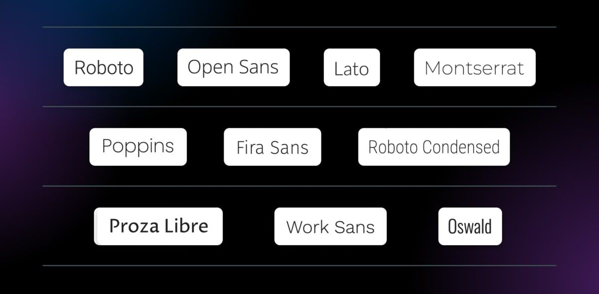</h3>


-   ## Imagery

    ### Homepage Hero
        
    The homepage features a colourful and self-explanatory hero landing image, suggesting the user explore itineraries from around the globe, leading to a search bar beneath to do just that. 
        
      <h3 align="center"></h3>

    ### About Page Hero
        
    The about page features a striking and self-explanatory hero image, of photos being uploaded all over the planet as a boat sails in and a plane takes off, illustrating the nature of the site to the user. 
        
      <h3 align="center"></h3>

    ### About Page Vibe Image  

    Additionally, a 'vibe' image is displayed at the bottom of the page, of a family sat around the fireplace sharing travel photos, to really imbue the emotional energy behind Hip Trip Hooray.

      <h3 align="center"></h3>

    ### Comment Section Map
        
    A sepia world map serves as the background to the comment section, reinforcing the travel journal aesthetic.

      <h3 align="center"></h3>

    ### User Images

      Otherwise, imagery on Hip Trip Hooray is almost entirely user-generated: Users upload their own photos for each category of their trip, (Sights | Flavours | Experiences | Vibes | Seasons), which are then displayed in their saved trip and / or published itinerary.

      <h3 align="center">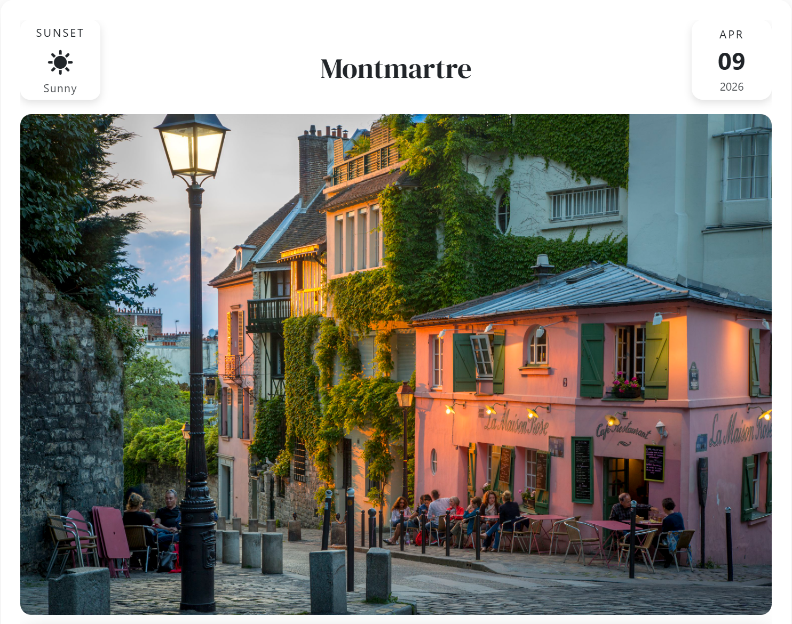</h3>
        

-   ## Icons

    ### Weather Icons

       Each stop on a trip can be assigned a weather condition. These are displayed as emoji icons within a stylized weather cube on both the trip builder preview and the published itinerary:

    ☀ Sunny · ☁ Cloudy · 🌧 Rainy · ❄ Snowy · 💨 Windy · ⛈ Stormy

    ### Country Flag

    A country flag is automatically displayed on each saved trip or  page, sourced dynamically from [flagcdn.com](https://flagcdn.com) using the country code stored against the itinerary.

    <h3 align="center"></h3>

    ### Font Awesome Icons
        
    I used icons from Font Awesome for navbar icons, page header icons and social media links in the footer, to add a little charm and improve clarity and efficiency for users.

-   #### Navbar & Page Header    

    <h3 align="center"></h3>

-   #### Footer Socials

    <h3 align="center">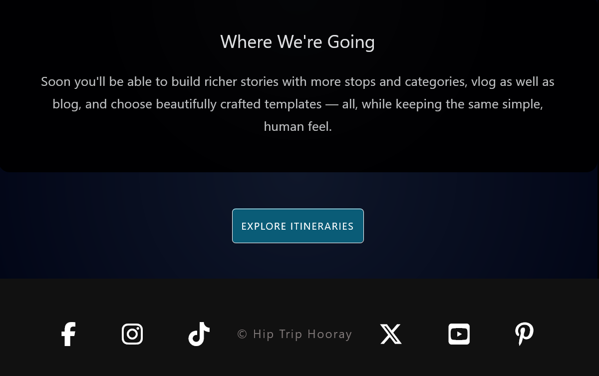</h3>

<br>
<br>

# Structure

-   Hip Trip Hooray is structured as a Django full-stack web application, with the following main sections:

| Page | Description |
|------|-------------|
| Home | Landing page with hero image, tagline & search bar |
| Sign In / Register | Authentication pages powered by django-allauth |
| Profile | Profile details |
| Explore Itineraries | Browse all published itineraries |
| My Itineraries | Dashboard of all published itineraries belonging to  the logged-in user giving them CRUD and Publish / Unpublish options |
| Itinerary Detail | View a single published itinerary |
| Create Itinerary | Build a new itinerary using the tabbed stop builder |
| My Trips | Dashboard of all trips belonging to the logged-in user giving them CRUD options | |
| Trip Detail | Private preview of a saved trip with the option to publish |
| Create Trip | Build a new trip using the tabbed stop builder |
| Sign Out | Log out of the website |
| About | Mission statement and platform description |
| Contact | Contact form |

# Irregular Structure


## Embedded CSS

Most of my css is in my stylesheet - but I have kept embedded css in my templates, in order to better control how my page displays within Bootstrap's frameworks.

## Embedded Javascript

I have kept embedded javascript, but greyed out, for certain itinerary and trip templates until I have successfully added more stops to each category - as this will involve editing the javascript that exists - and I find it much more efficient to swap just the templates within my IDE, than having to juggle templates and corresponding .js files. Functioning js scripts exist in the static/js folder for trip_form, trip_detail and itinerary_detail, as they should, but I have kept the marked-out javascript embedded in those templates too.

<br>
<br>

# Features

-   ## Current Features

### Landing Page

The homepage greets users with a full-width hero image, the Hip Trip Hooray tagline — *Explore · Share · Hooray* — and clear calls to action to explore itineraries or register.

<h3 align="center"></h3>

### Hamburger Navigation

A clean, responsive navigation bar provides links to all key sections of the site. When a user is logged in, the nav updates to show their personal dashboards and a logout option.

<h3 align="center"></h3>

### Explore Itineraries

A browseable list of all published itineraries, each displayed as a card with the trip title, destination and country flag. Users can search and filter by destination.


### Itinerary Detail — 5 Category Tabs + Context + Story

The centerpiece of the platform. Each published itinerary is presented with tabbed categories — Sights, Flavours, Experiences, Vibes, Seasons. Each slide features the user's photo, weather cube, calendar badge, story title and story description.

<h3 align="center"></h3>

### Trip Builder — Create & Edit

The trip creation form is a fully interactive builder, featuring:

- **Location search** — search for any city in the world using OpenStreetMap / Nominatim, which automatically populates the destination, title and coordinates
- **Interactive map** — click anywhere on the map to set the trip location
- **Category tabs** — one tab per category (Sights, Flavours, Experiences, Vibes, Seasons), each with its own stop form
- **Live preview** — a real-time preview panel shows exactly how the stop will look when published, updating as the user types, including the weather cube, calendar badge, story and image preview
- **Image upload** — users can upload a photo for each stop
- **Date, weather & time of day** — selectable for each stop

<h3 align="center"></h3>


 -   ### Maps

 -   #### Trip Creation Map + Preview Map

        2 interactive OpenStreetMap maps are embedded in the trip creation form, one at the top and one in live preview, allowing users to search for their destination and set the precise location for their trip and each individual stop.

-   #### Saved Trip / Published Itinerary Map

    The same OpenStreetMap map seen is saved and embedded in the saved trip and published itinerary.


### Publish Trip as Itinerary

Once a user is happy with their trip, a single click publishes it as a public itinerary, visible to all users on the Explore page.

<h3 align="center"></h3>

### Use as Template

Any published itinerary can be used as a template by any logged-in user. One click creates a new personal trip pre-populated with all the stops from that itinerary, ready to edit and personalise.

<h3 align="center"></h3>

### My Trips Dashboard

A personal dashboard listing all of the logged-in user's trips, with options to view, edit or delete each one.

<h3 align="center"></h3>

### My Itineraries Dashboard

A personal dashboard listing all of the logged-in user's itineraries, with options to view, edit, publish/unpublish or delete each one.

<h3 align="center">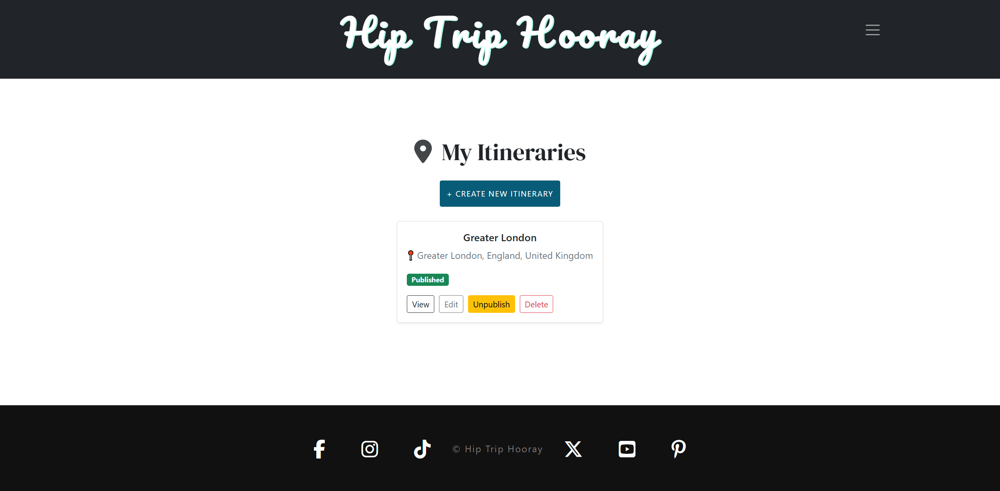</h3>

### Comments

Authenticated users can leave comments on any published itinerary. Comments are subject to approval before appearing publicly. Users can edit and delete their own comments.

<h3 align="center"></h3>

### Contact Page

A simple contact form allowing any visitor to get in touch with the Hip Trip Hooray team.

<h3 align="center"></h3>

### Authentication

Full user authentication is handled by [django-allauth](https://django-allauth.readthedocs.io/), including registration, login, logout and password management.

<h3 align="center"></h3>

<br>

### Responsive Design

Hip Trip Hooray is fully responsive across all screen sizes — mobile, tablet and desktop. Please see images under testing.

<br>

-   ## Future Features

- :x: *Follow other travelers and receive notifications when they publish*
- :x: *Vlog support — embed video content within trip stops*
- :x: *Beautifully designed trip templates to choose from*
- :x: *Multiple stops per category tab*
- :x: *AI-generated travel suggestions based on destination*
- :x: *In-app booking for accommodation and tours*
- :x: *Social sharing buttons on itinerary pages*
- :x: *Buddy up with fellow travelers looking to do similar itineraries*.
- :x: *Book accommodation or tours directly from an itinerary*.
- :x: *Review itineraries and earn travel prizes for the best rated*.
- :x: *to filter itineraries using certain parameters*.
- :x: *a mini map with markers for precise co-ordinates of each trip stop*.
- :x: *a trip timeline, synced up to each trip date and the map markers, placed next to the mini map*.
- :x: *mosaic tiling as a background for the trip and itinerary cards*.
- :x: *a tile image, uploaded by the user, which displays when the user hovers over the mosaic tiles of the trip and itinerary cards*.

<br>

# Wireframes

-   ## Landing Page & Results Page

<h3 align="center">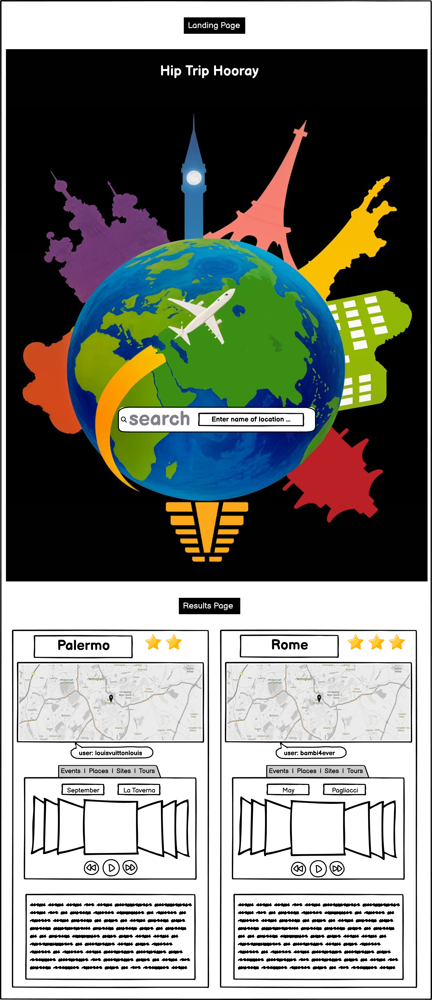</h3>

-   ## Create Trip Form

<h3 align="center">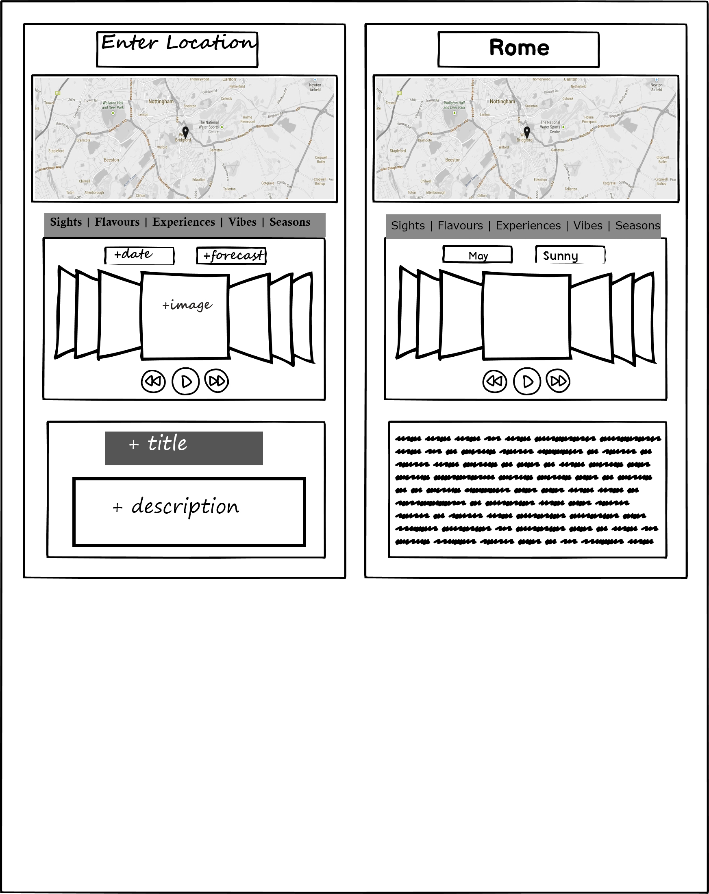</h3>

<br>


# Database Schema

## Schema Rationale

HipTripHooray was designed around a modular travel-planning architecture that separates user-created trips from publicly shared itineraries, but loops the two, allowing saved trips to become published itineraries and published itineraries to be used as templates for new trips.

This approach allows users to:

- privately build and edit trips,
- organise stops into themed categories,
- later publish selected trips as public itineraries,
- and safely interact with community content through comments and templates.

The database structure prioritizes:

- scalability,
- ownership security,
- flexible content relationships,
- and future expansion for itinerary sequencing and collaborative travel planning.

---

# ERD

## Entity Relationship Diagram (ERD)

```text
+------------------+
| User             |
+------------------+
| id               |
| username         |
| email            |
| password         |
+------------------+
         |
         | 1-to-many
         v

+------------------+
| Trip             |
+------------------+
| id               |
| owner_id (FK)    |
| title            |
| description      |
| destination      |
| latitude         |
| longitude        |
| country_code     |
| weather          |
| travel_date      |
| is_published     |
| created_at       |
+------------------+
         |
         | 1-to-many
         v

+------------------+
| TripItem         |
+------------------+
| id               |
| trip_id (FK)     |
| category_id (FK) |
| title            |
| description      |
| image            |
| stop_order       |
| display_order    |
+------------------+
         |
         | many-to-1
         v

+------------------+
| Category         |
+------------------+
| id               |
| name             |
| icon             |
+------------------+


Trip
  |
  | 1-to-1 / linked publish
  v

+------------------+
| Itinerary        |
+------------------+
| id               |
| owner_id (FK)    |
| source_trip_id   |
| title            |
| description      |
| destination      |
| created_at       |
+------------------+
         |
         | 1-to-many
         v

+------------------+
| ItineraryItem    |
+------------------+
| id               |
| itinerary_id(FK) |
| category_id (FK) |
| title            |
| description      |
| image            |
+------------------+


Itinerary
   |
   | 1-to-many
   v

+------------------+
| Comment          |
+------------------+
| id               |
| itinerary_id(FK) |
| author_id (FK)   |
| body             |
| approved         |
| created_at       |
+------------------+
```

<h3 align="center">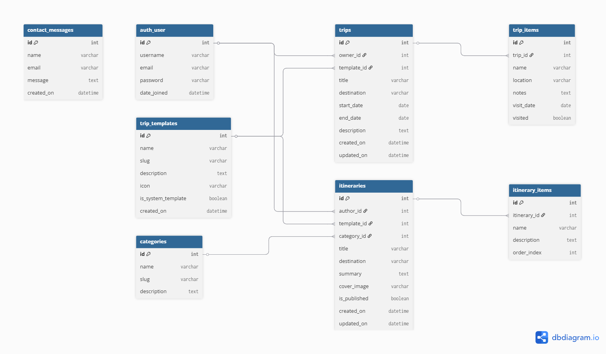</h3>

<br>
<br>

# Core Architectural Decisions

## 1. Separation of Trips and Published Itineraries

Trips and itineraries are intentionally stored as separate models.

### Rationale

This allows users to:

- maintain private editable drafts
- experiment freely without affecting public content
- publish snapshots of trips
- and continue editing after publishing

When a trip is published:

- a linked itinerary is generated
- trip items are duplicated into itinerary items
- and the itinerary becomes independently viewable by the public
- slugs are also introduced at this stage for optimized SEO

This architecture avoids accidental public exposure of unfinished content.

---

## 2. Modular TripItem Structure

Each trip contains multiple `TripItems` grouped into categories such as:

- Sights
- Flavours
- Experiences
- Vibes
- Seasons

### Rationale

This design supports:

- flexible itinerary storytelling,
- dynamic category tabs,
- scalable stop management (*to be implemented in the future*)
- and future drag-and-drop ordering systems.


The planned `stop_order` system separates:

- user travel sequence

from:

- admin/UI display ordering

This improves long-term maintainability.

---

## 3. Category Abstraction

Categories are stored in their own model rather than hardcoded.

### Rationale

This enables:

- reusable category logic
- easier styling/icon management
- database consistency
- and future category expansion without schema changes

---

# Security Overview

## Authentication Security

HipTripHooray uses Django’s built-in authentication framework.

### Features

- hashed passwords
- session authentication
- CSRF protection
- protected authenticated routes
- secure login/logout handling

Unauthenticated users are redirected when attempting to access protected pages.

---

## Ownership-Based Permissions

Trips are always filtered by ownership.

### Example Logic

```python
Trip.objects.get(pk=pk, owner=request.user)
```

<br>
<br>


# Technologies

## Languages

- [HTML5](https://developer.mozilla.org/en-US/docs/Web/HTML)
- [CSS3](https://developer.mozilla.org/en-US/docs/Web/CSS)
- [JavaScript](https://developer.mozilla.org/en-US/docs/Web/JavaScript)
- [Python 3.11](https://www.python.org/)

## Frameworks, Libraries & Programs

- [Django 4.2](https://www.djangoproject.com/) — the core web framework
- [PostgreSQL](https://www.postgresql.org/) — production database, hosted on [Neon](https://neon.tech/)
- [Cloudinary](https://cloudinary.com/) — cloud media storage for user-uploaded images in production
- [Whitenoise](https://whitenoise.readthedocs.io/) — static file serving in production
- [django-allauth](https://django-allauth.readthedocs.io/) — user authentication
- [django-crispy-forms](https://django-crispy-forms.readthedocs.io/) — form rendering with Bootstrap 5
- [dj-database-url](https://pypi.org/project/dj-database-url/) — database URL parsing for Heroku
- [Gunicorn](https://gunicorn.org/) — WSGI HTTP server for production
- [Bootstrap 5](https://getbootstrap.com/) — responsive front-end framework
- [Leaflet.js](https://leafletjs.com/) — interactive maps
- [OpenStreetMap](https://www.openstreetmap.org/) — map tile provider
- [Nominatim](https://nominatim.org/) — geocoding / location search
- [flagcdn.com](https://flagcdn.com) — country flag images
- [Font Awesome](https://fontawesome.com/) — icons
- [Google Fonts](https://fonts.google.com/) — typography
- [Heroku](https://www.heroku.com/) — cloud deployment platform
- [Git](https://git-scm.com/) — version control
- [GitHub](https://github.com/) — code repository
- [dbdiagram.io](https://dbdiagram.io/home) — ERD creator

<br>
<br>

# Testing

The Hip Trip Hooray website has been tested using the following methods:

- [Testing](#testing)
- [Testing User Stories](#testing-user-stories)
    - [Testing Visitor Goals](#testing-visitor-goals)
- [Django Apps Test](#django-app-tests)
- [Testing Functionality](#testing-functionality)
- [Code Validation](#code-validation)
    - [W3C HTML Validator](#w3c-html-validator)
        - [Homepage](#homepage)
        - [About](#about-page)
        - [Explore Itineraries](#explore-itineraries)
    - [W3C CSS Validator](#w3c-css-validator)
    - [JSHint Javascript Validator](#jshint-javascript-validator)
- [Lighthouse](#lighthouse)
    - [Desktop](#desktop)
    - [Mobile](#mobile)
- [Browser Compatibility](#browser-compatibility)
- [Responsiveness](#responsiveness)
    - [Iphone](#iphone)
    - [Ipad](#ipad)
    - [Nest Hub Max](#nest-hub-max)
    - [FHD (1920x1080)](#fhd-1920x1080)
    - [2k (2560x1440)](#2k-2560x1440)
    - [4K (3840 x 2160)](#4k-3840-x-2160)
- [Debugging](#debugging)
    - [Resolved](#resolved)    
    - [Unresolved](#unresolved)

    <br>

**Return to TOC at the top:**

- [Table of Contents](#table-of-contents)

<br>
<br>

## Importance of Automated & Manual Testing

### Automated

**Using automated testing to test code has several advantages over manual testing:**

* Quicker - Multiple tests can be run on the same piece of code concurrently, and in a short space of time.

* More Holistic - The ability to very quickly establish how the site will perform as a whole.

* More Exact - The ability to find more bugs, including unknown bugs.

* More Accurate - Less room for human error -- tests are only as good as the tester(s), and can therefore end up being purely decorative.

* More Honest - Less prone to manipulation or corruption.

### Manual

**Using manual testing to test code has several advantages over automated testing:**

* More Precise - No waiting for other tests to finish - one specific piece can be perfected.

* More Initiative - Tests can be written while programming, so that errors can be picked up as early as possible during development.

* More Adaptive / Flexible - Tests can remain within our code for the future (*regressive testing*), so that if ever future developments conflict with our current functionality, the programmer can be alerted with immediate effect.

* More Organic - Automated tests don't test the User Experience beyond the performative, so manual testing is essential to get a full understanding of the user experience (UX).

<br>
<br>

## Testing User Stories

<br>

### Testing Visitor Goals

| User Story | Result |
|------------|--------|
| Register for an account and log in securely | :white_check_mark: |
| Create a trip with destination, stops and photos | :white_check_mark: |
| Use category tabs to organise trip stops | :white_check_mark: |
| See a live preview while building the trip | :white_check_mark: |
| Upload photos to each stop | :white_check_mark: |
| Record date, weather and time of day | :white_check_mark: |
| Set location on an interactive map | :white_check_mark: |
| Save a trip as a draft | :white_check_mark: |
| Publish a trip as a public itinerary | :white_check_mark: |
| Edit a saved trip | :white_check_mark: |
| Delete a trip | :white_check_mark: |
| Browse published itineraries | :white_check_mark: |
| View an itinerary with category tabs | :white_check_mark: |
| Use an itinerary as a template | :white_check_mark: |
| Leave, edit and delete comments | :white_check_mark: |
| View mini maps on itinerary stops | :white_check_mark: |
| See country flags on itineraries | :white_check_mark: |
| Use site on mobile, tablet and desktop | :white_check_mark: |
| Contact the team via a form | :white_check_mark: |

<br>
<br>


## Manual Testing

### Trip Creation

| Test | Action | Expected Result | Pass/Fail |
|---|---|---|---|
| Create trip with all 5 category tabs filled | Fill in Sights, Flavours, Experiences, Vibes and Seasons tabs and submit | All 5 trip items saved correctly with correct categories | ✅ Pass |
| Create trip with only Sights tab filled | Fill Sights only, leave other tabs empty | Only Sights item saved, empty tabs skipped | ✅ Pass |
| Create trip without selecting a location on the map | Submit form without searching or clicking map | Trip saves with null coordinates | ✅ Pass |
| Live preview updates on typing | Type in description field | Preview panel updates in real time | ✅ Pass |
| Live preview updates weather cube | Select weather from dropdown | Weather icon and label update immediately in preview | ✅ Pass |
| Live preview updates calendar badge | Select a travel date | Calendar badge updates with correct month/day/year | ✅ Pass |
| Category tab switching | Click between Sights, Flavours etc | Active tab panel shows, others hide | ✅ Pass |
| Image upload preview | Upload an image on any stop | Preview image appears in live preview panel | ✅ Pass |
| Map search populates destination | Type a city in location search | Map flies to city, destination and title fields auto-populated | ✅ Pass |
| Country code saved on trip | Search for a city | Correct country flag displayed on trip detail | ✅ Pass |

---

### Trip Publishing

| Test | Action | Expected Result | Pass/Fail |
|---|---|---|---|
| Publish trip creates itinerary | Click Publish Trip as Itinerary | New itinerary created with matching title, destination and items | ✅ Pass |
| Published itinerary appears on Explore page | Publish a trip | Itinerary visible on Explore Itineraries page | ✅ Pass |
| Trip marked as published after publish | Publish a trip | Published badge shown on trip detail, publish button replaced | ✅ Pass |
| Edit trip syncs published itinerary | Edit a published trip and save | Linked itinerary title, description and all items updated | ✅ Pass |
| Author name displayed on published itinerary | View published itinerary | Correct username shown on each slide | ✅ Pass |
| Author name displayed on saved trip | View saved trip detail | Owner username shown on each slide | ✅ Pass |

---

### Authentication & Permissions

| Test | Action | Expected Result | Pass/Fail |
|---|---|---|---|
| Logged out user cannot access trip create | Navigate to `/trips/create/` while logged out | Redirected to login page | ✅ Pass |
| User cannot view another user's trip | Enter another user's trip URL directly | 404 returned | ✅ Pass |
| User cannot edit another user's trip | Enter another user's trip edit URL | 404 returned | ✅ Pass |
| Register new account | Complete registration form | Account created, redirected to itinerary list | ✅ Pass |
| Login with valid credentials | Submit login form | Logged in, redirected correctly | ✅ Pass |
| Logout | Click Sign Out | Session ended, redirected to home | ✅ Pass |

---

### Comments

| Test | Action | Expected Result | Pass/Fail |
|---|---|---|---|
| Submit comment | Submit comment form on itinerary | Success message shown, comment awaiting approval | ✅ Pass |
| Comment not visible before approval | Submit comment, view as different user | Comment not visible until approved | ✅ Pass |
| Edit own comment | Click Edit on own comment | Comment text becomes editable, saves correctly | ✅ Pass |
| Delete own comment | Click Delete on own comment | Delete modal appears, comment deleted on confirm | ✅ Pass |
| Non-author cannot see edit/delete buttons | View itinerary as different user | Edit/Delete buttons not visible on others' comments | ✅ Pass |

---

### Use as Template

| Test | Action | Expected Result | Pass/Fail |
|---|---|---|---|
| Use itinerary as template | Click Create a Trip Using This Itinerary | New trip created pre-populated with all stops from itinerary | ✅ Pass |
| Template trip is editable | Open the newly created template trip | All fields editable, can be saved and published | ✅ Pass |

---

### Responsive Design

| Test | Device/Width | Expected Result | Pass/Fail |
|---|---|---|---|
| Navigation burger menu | Mobile (< 768px) | Hamburger menu appears, links accessible | ✅ Pass |
| Trip builder tabs | Mobile | Tabs wrap cleanly, all accessible | ✅ Pass |
| Carousel slides | Mobile | Full width slides, no overflow | ✅ Pass |
| Weather cube + calendar badge | Mobile | Both display correctly side by side | ✅ Pass |
| My Trips card grid | Desktop | 3 cards per row | ✅ Pass |
| My Trips card grid | Tablet | 2 cards per row | ✅ Pass |
| My Trips card grid | Mobile | 1 card per row | ✅ Pass |

---

### Weather Icons

| Test | Action | Expected Result | Pass/Fail |
|---|---|---|---|
| Sunny icon displays | Set weather to Sunny | ☀ displayed in weather cube | ✅ Pass |
| Cloudy icon displays | Set weather to Cloudy | ☁ displayed | ✅ Pass |
| Rainy icon displays | Set weather to Rainy | 🌧 displayed | ✅ Pass |
| Snowy icon displays | Set weather to Snowy | ❄ displayed | ✅ Pass |
| Windy icon displays | Set weather to Windy | 💨 displayed | ✅ Pass |
| Stormy icon displays | Set weather to Stormy | ⛈ displayed | ✅ Pass |

<br>
<br>

## Django App Tests

<br>

For Django tests for the itineraries app and the trips app, please check:

- `itineraries/tests.py`
- `trips/tests.py`

Run all Django tests with:

```bash
python manage.py test
```

or for a specific app

```bash
python manage.py test trips
```

```bash
python manage.py test itineraries
```

<br>
<br>

# Testing Functionality

The W3C Markup Validator and W3C CSS Validator Services were used to validate every page of the project to ensure there were no syntax errors in the project.

-   [W3C Markup Validator](https://validator.w3.org/#validate_by_input)
-   [W3C CSS Validator](https://jigsaw.w3.org/css-validator/#validate_by_input)

## Code Validation

## W3C HTML Validator

## HTML Validation

- Due to the use of Django templating syntax, direct validation of raw template files produced false-positive errors within the W3C validator.

- To ensure accurate validation, rendered HTML output from the browser was validated instead using the W3C Markup Validation Service.

- The application was tested page-by-page after rendering dynamic Django content.

The Hip Trip Hooray website passed all tests using the W3C HTML Validator tool

<br>

-   ### Homepage

<h2 align="right">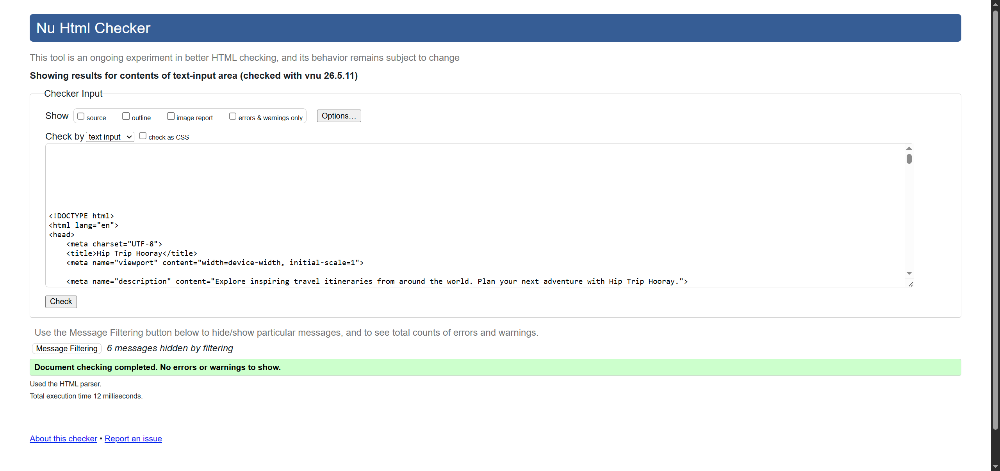</h2>

<br>

-   ### Ideas / Explore Itineraries Page 

<h2 align="right"></h2>

<br>

-   ### Your Itineraries Page 

<h2 align="right">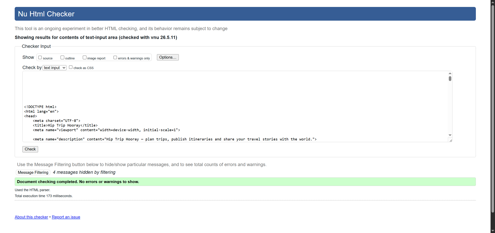</h2>

<br>

-   ### Your Trips Page 

<h2 align="right"></h2>

<br>

-   ### About Page 

<h2 align="right">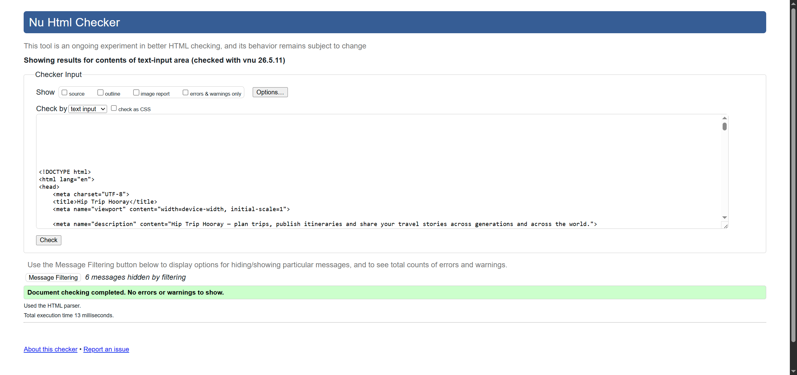</h2>

<br>

-   ### Contact Page 

<h2 align="right">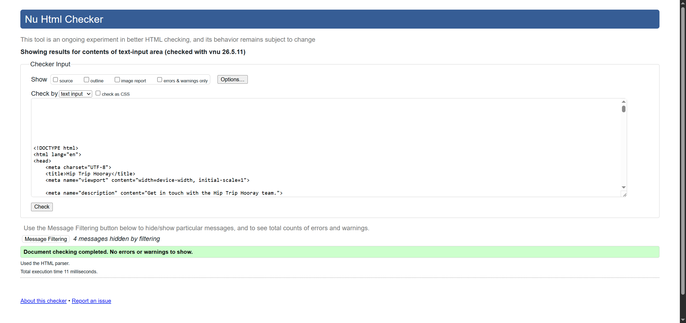</h2> 

<br>

## W3C CSS Validator

The Hip Trip Hooray website passed all tests using the W3C CSS Validator tool
<h2 align="center">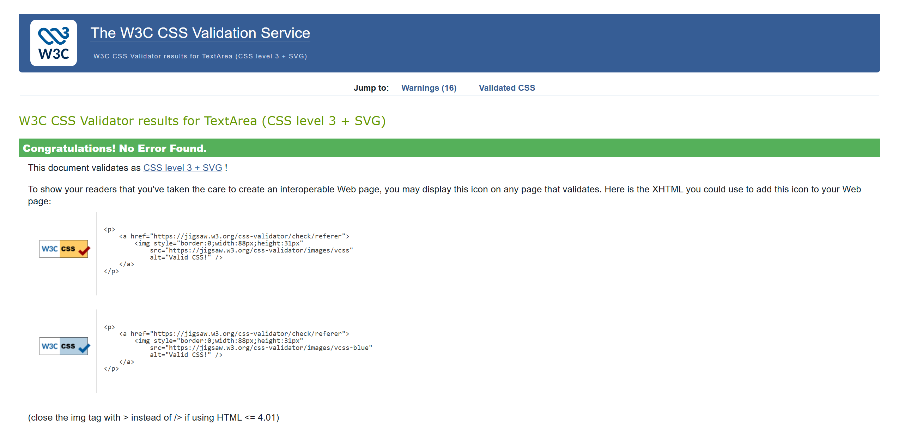</h2>

<br>
<br>

## JSHint Javascript Validator

The Hip Trip Hooray website passed all tests using the JSHint JS Validator, with only warnings and no errors reported.

<br>

### Homepage

<h2 align="center">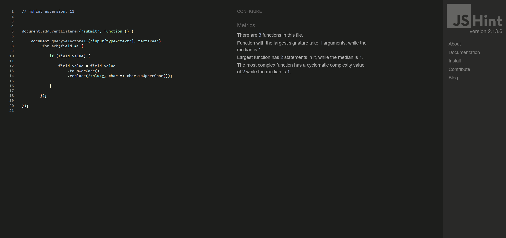</h2>

<br>

### Trip Form Create

<h2 align="center"></h2>

<br>

### Trip Detail

<h2 align="center"></h2>

<br>

### Itinerary Detail

<h2 align="center">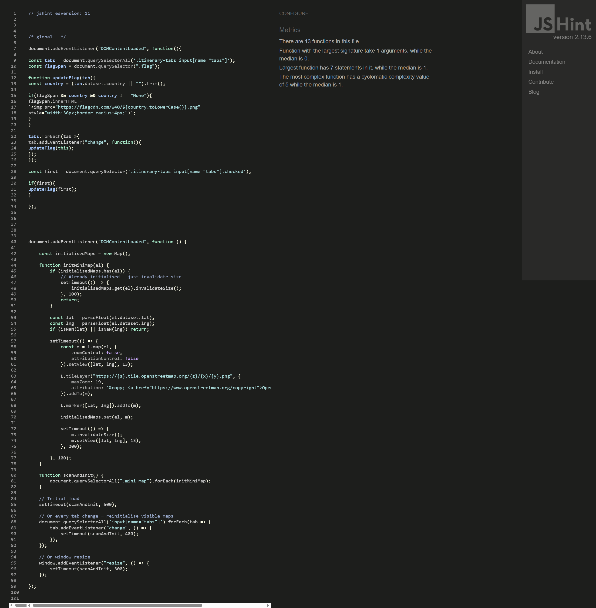</h2>

<br>
<br>

## Lighthouse

I used the Lighthouse reports in Google Developer Tools to examine the pages of the website for the following:

- Performance
- Accessibility
- Best Practices 
- SEO

### Desktop:

<br>

### Homepage

Homepage scored:
- Performance - 99
- Accessibility - 93
- Best Practices - 96
- SEO - 100

<h2 align="center">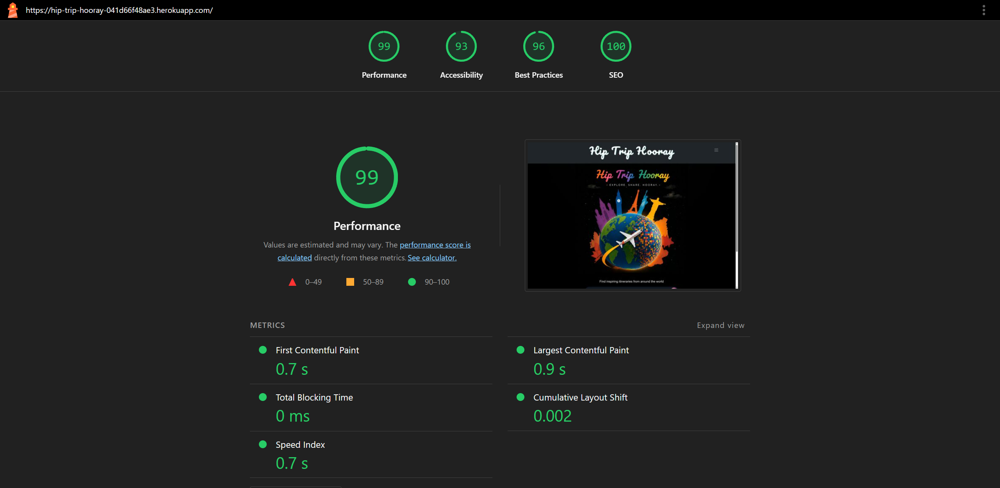</h2>

<br>

### Ideas / Explore Itineraries Page

Homepage scored:
- Performance - 97
- Accessibility - 92
- Best Practices - 100
- SEO - 100

<h2 align="center">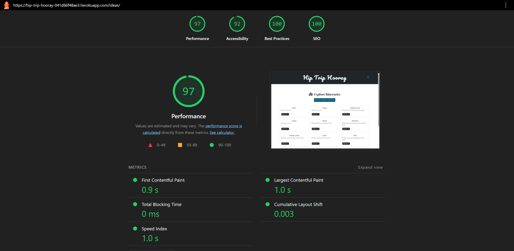</h2>

<br>

### About Page

Homepage scored:
- Performance - 95
- Accessibility - 92
- Best Practices - 100
- SEO - 100

    
<h2 align="center">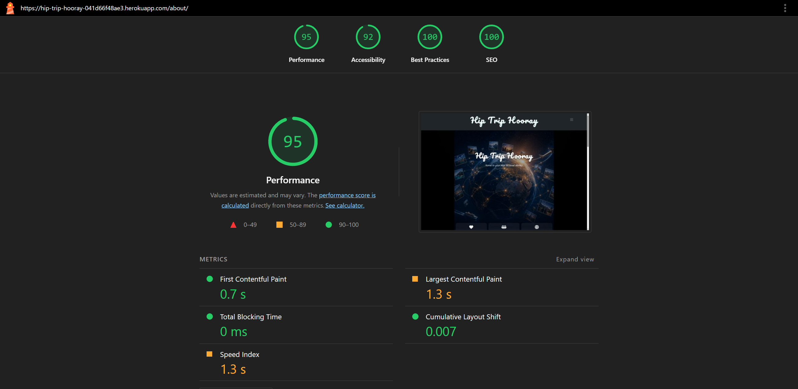</h2>

<br>

### Contact Page

Homepage scored:
- Performance - 99
- Accessibility - 92
- Best Practices - 100
- SEO - 100

    
<h2 align="center">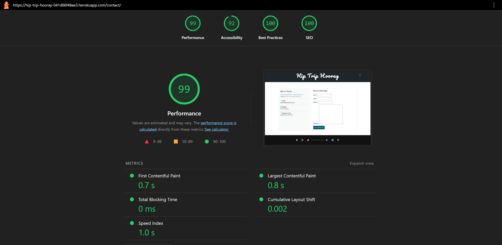</h2>

<br>

### Mobile:

<br>

### Homepage (Mobile)

Homepage scored:
- Performance - 95
- Accessibility - 93
- Best Practices - 96
- SEO - 100
    
<h2 align="center">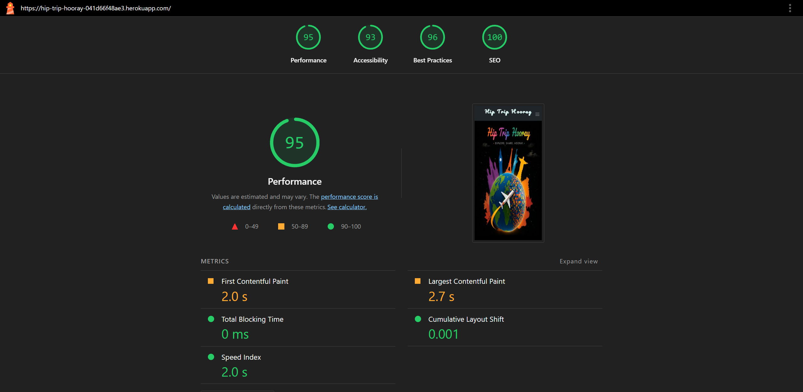</h2>

<br>

-   All pages load fast and perform well for desktop and mobile.

<br>

## Future Improvements

  
-  I will work to improve Accessibility & Best Practices even more across all pages.

<br>
<br>
   
## Browser Compatibility

The site was tested in Brave, Google Chrome, Microsoft Edge and Mozilla Firefox on Desktop.

The site was tested in Brave, Google Chrome and Firefox on Mobile and Tablet.

No issues arose during browser testing. 

Appearance, functionality and responsiveness were largely consistent across browsers and devices, adapting fluidly when changing from portrait to landscape mode.

<br>
<br>

## Responsiveness

Responsiveness tests were carried out using Google Chrome DevTools & Microsoft Edge DevTools. Device screen sizes covered include:

- iPhone SE
- iPhone XR
- iPhone 12 Pro
- Pixel 5
- Samsung Galaxy S8+
- Samsung Galaxy S20 Ultra
- iPad Mini
- iPad Air
- Surface Pro 7
- Surface Duo
- Galaxy Fold
- Samsung Galaxy A51/71
- Nest Hub
- Nest Hub Max

### Iphone 
<h2 align="center"></h2>

### Ipad 
<h2 align="center"></h2>

### Nest Hub Max 
<h2 align="center"></h2>

I also created custom settings for FHD (1920x1080), 2k (2560x1440) & 4K (3840 x 2160) screens to verify the web pages would work across monitor sizes. 

### FHD (1920x1080) 
<h2 align="center"></h2>

### 2k (2560x1440)
<h2 align="center"></h2>

### 4K (3840 x 2160)
<h2 align="center"></h2>

<br>
<br>

## Debugging

These include the bugs I was encountering when incorporating more than one stop per category, hence the removal of that functionality for the time being. You can find these bugs in the unresolved section.

<br>

-   ## Resolved

1. **500 error on trip creation (Heroku / PostgreSQL)** — The trip creation view was binding the formset to an unsaved `Trip` instance with no primary key. When Django attempted to save the inline items, the foreign key reference pointed to a non-existent row, causing a database integrity error. Fixed by removing the `instance=temp_trip` binding on POST and assigning `item.trip = trip` within the save loop after the parent trip had been committed to the database.

2. **Cloudinary config vars missing** — The settings file was reading three separate Cloudinary environment variables (`CLOUDINARY_CLOUD_NAME`, `CLOUDINARY_API_KEY`, `CLOUDINARY_API_SECRET`), but only `CLOUDINARY_URL` had been set in the Heroku config vars. Fixed by adding all three required vars to the Heroku dashboard.

3. **Extra category tabs not saving (PostgreSQL)** — The hidden category inputs in the trip form template were using Django queryset index notation (`categories.1.id`, `categories.2.id` etc.), which relies on the order PostgreSQL returns records. Unlike SQLite, PostgreSQL does not guarantee a consistent return order without explicit ordering, meaning category IDs were being assigned incorrectly. Fixed by passing a `category_map` dictionary (keyed by lowercase category name) from the view to the template, and referencing categories by name (`category_map.flavours`) rather than by index position.

4. **Firefox 403 errors on OpenStreetMap tiles** — Firefox applies a stricter `Referrer-Policy` than Chrome, stripping the `Referer` header from tile requests. OpenStreetMap's tile servers began rejecting these requests with a 403. Fixed by adding `<meta name="referrer" content="no-referrer-when-downgrade">` to the base template, instructing Firefox to send the referrer header on all requests.

5. **Itinerary not updating after trip edit** — When a user edited their trip, the linked published itinerary was not being synced. The itinerary was only ever written once, at the point of publication. Fixed by adding a sync block at the end of the `trip_edit` view, which detects any linked itinerary via `trip.published_itineraries.first()`, updates its top-level fields and rebuilds all its items from the current state of the trip.

6. **`unique_together` constraint on `TripItem`** — The `TripItem` model had a `unique_together = ["trip", "display_order"]` constraint. PostgreSQL enforces this strictly at the row level on every write, meaning that saving multiple new items (all defaulting to `display_order=0`) caused an integrity error on the second save. SQLite silently ignored this collision. Fixed by removing the `unique_together` constraint.

7. **Story preview showing incorrect content after switching tabs** — The live trip preview sometimes continued displaying content from a previously selected stop after changing category tabs. The active preview state was not being reset correctly. Fixed by introducing an `activeStops` object keyed by category and restoring the correct active stop when tabs changed.

8. **Location search not updating trip destination fields correctly** — Searching for a city with the OpenStreetMap Nominatim API updated the map marker but did not consistently populate the hidden destination and country fields required elsewhere in the app. Fixed by extracting `display_name`, city-level address data, and `country_code` from the API response and writing them directly into the relevant form inputs after every successful search.

9. **Published itineraries visible to all users** — Early itinerary queries returned every published itinerary in the database, including content owned by other users. Fixed by filtering queryset results against the authenticated user where appropriate and separating public discovery views from owner-only dashboard views.

10. **Delete actions triggering accidental removals** — Trips and itineraries could initially be deleted immediately from dashboard buttons with no confirmation step. Fixed by introducing Bootstrap confirmation modals that dynamically inject the correct delete URL before submission.

11. **Heroku static assets not updating after deployment** — CSS and JavaScript changes occasionally appeared missing in production because stale static files were still being served. Fixed by ensuring `collectstatic` ran during deployment and by clearing cached static assets after major frontend updates.

12. **Trip cards collapsing into narrow columns on dashboard pages** — When only one trip or itinerary existed, Bootstrap grid constraints caused cards to render as small centred columns instead of stretching across the available width. Fixed by removing restrictive column sizing (`col-lg-5`) and centring row classes in favour of full-width responsive columns.

13. **Trip form capitalisation inconsistencies** — Users could submit trip titles and destinations in inconsistent formats such as `paris`, `NEW YORK`, or `hidden gems of tokyo`. Fixed by adding a pre-submit JavaScript formatter that converts text inputs and textareas into title case immediately before form submission.

14. **Firefox and Chrome rendering different map behaviours** — Certain OpenStreetMap and Leaflet interactions behaved differently across browsers due to stricter Firefox security and referrer handling policies. 403 errors & referrer requests were fixed by aligning referrer policies and testing tile-loading behaviour consistently across both browsers.

15. **Dynamic formset fields not saving correctly after adding new forms** — Newly generated formset entries were sometimes ignored during submission because `TOTAL_FORMS` was not being updated after DOM insertion. Fixed by incrementing the management form count every time a new dynamic form was added.

16. **Live preview panel failing after dynamically added content** — Event listeners attached directly to page-load elements did not apply to dynamically injected trip form fields, causing preview updates to stop working for newly added content. Fixed by replacing direct listeners with delegated document-level listeners.

<br>

-   ## Resolved (Future Feature - Stops)

1. **Trip preview image not updating for dynamically added stops** — Newly added stop cards could upload images successfully, but the live preview panel was only listening to the original static file inputs rendered on page load. Fixed by switching to delegated event listeners using `document.addEventListener("change")`, allowing dynamically created stop image inputs to update the preview correctly.

2. **Trip stop coordinates not syncing across category tabs** — Clicking the Leaflet map only updated the currently active stop card, meaning the “stop zero” cards in other category tabs were missing coordinates and failed to render maps later. Fixed by looping through all `.stop-0` cards and writing latitude/longitude values to each hidden coordinate field whenever the map or search location changed.

3. **Dynamic stop numbering breaking after deletion** — Removing a stop card caused gaps or duplicate numbering in the remaining trip stops because `display_order` values were not recalculated after DOM removal. Fixed by rebuilding stop numbering through `updateStopNumbers()` whenever stops were added or removed.

4. **Trip title not propagating to dynamically added stop forms** — Additional stop forms created from the hidden template were not inheriting the parent trip title before submission, causing blank titles in saved `TripItem` records. Fixed by adding a final submit hook that loops through all `.stop-card` elements and injects the current trip title into each hidden `.stop-title` field before form submission.

<br>
<br>

-   ## Heroku Free Dynos Cold Start Bug

-   The website takes seconds to load, and sometimes on first page load the user will get a 500 Internal Server Error. If the user reloads the page, all functionality will resume, but it is frustrating that performance is hit so badly by the cold start of using a Heroku free dynos package.

    Using 

    `heroku logs --tail --app hip-trip-hooray`

    proves as much with the following logs;

    `heroku[web.1]: Idling`
    `heroku[web.1]: State changed from up to down`

    `heroku[web.1]: Unidling`
    `State changed from down to starting`

<br>
<br>

# Deployment

## Heroku

Hip Trip Hooray is deployed to [Heroku](https://www.heroku.com/) using the following steps:

1. Create a new Heroku app from the [Heroku Dashboard](https://dashboard.heroku.com/).
2. Under **Settings → Config Vars**, add the following environment variables:

| Key | Value |
|-----|-------|
| `SECRET_KEY` | Your Django secret key |
| `DATABASE_URL` | Your PostgreSQL connection string (e.g. from Neon) |
| `CLOUDINARY_CLOUD_NAME` | Your Cloudinary cloud name |
| `CLOUDINARY_API_KEY` | Your Cloudinary API key |
| `CLOUDINARY_API_SECRET` | Your Cloudinary API secret |
| `CLOUDINARY_URL` | Your full Cloudinary URL |
| `DEBUG` | `False` |

3. Ensure the following files are present in the repository root:
    - `Procfile` containing: `web: gunicorn hiptriphooray.wsgi`
    - `requirements.txt` with all dependencies listed
    - `.python-version` containing: `3.11`
    - `.gitignore` including at least: `env.py` and `.sqlite3` 

4. Connect the Heroku app to your GitHub repository under **Deploy → GitHub**.
5. Enable **Automatic Deploys** from the `main` branch, or click **Deploy Branch** to deploy manually.
6. Run database migrations after first deploy:
    ```
    heroku run python manage.py migrate -a your-app-name
    ```
7. Create a superuser if required:
    ```
    heroku run python manage.py createsuperuser -a your-app-name
    ```
<br>

## Forking the GitHub Repository

By forking the GitHub Repository we make a copy of the original repository on our GitHub account to view and/or make changes without affecting the original repository by using the following steps:

1. Log in to GitHub and locate the [GitHub Repository](https://github.com/).
2. At the top of the Repository (not top of page) just above the **Settings** Button on the menu, locate the **Fork** Button.
3. You should now have a copy of the original repository in your GitHub account.

<br>

## Cloning the Repository

1. Log in to GitHub and locate the repository.
2. Click the **Code** button and copy the HTTPS URL.
3. Open your terminal and run:
    ```
    git clone https://github.com/your-username/hip-trip-hooray.git
    ```
4. Create a virtual environment and install dependencies:
    ```
    python -m venv venv
    source venv/bin/activate
    pip install -r requirements.txt
    ```
5. Create an `env.py` file in the root directory with your local environment variables:
    ```python
    import os
    os.environ["SECRET_KEY"] = "your-secret-key"
    os.environ["DEBUG"] = "True"
    ```
6. Run migrations and start the development server:
    ```
    python manage.py migrate
    python manage.py runserver
    ```

<br>
<br>

# Credits

<br>

## Code

-   [Code Institute](https://codeinstitute.net/): I referred back to tutorial videos and my notes taken throughout the process of developing this project:
    -   The foundation of all HTML, CSS, JavaScript and Python were learnt during the Code Institute course and respective challenges.
    -   I referred to the code from Code Institute's example projects for inspiration and best practice.

-   [Django Documentation](https://docs.djangoproject.com/): The official Django docs were referenced extensively throughout development, particularly for formsets, model relationships, authentication and deployment.

-   [Leaflet.js Documentation](https://leafletjs.com/reference.html): Used throughout the map implementation.

-   [Stack Overflow](https://stackoverflow.com/): Referenced for numerous specific implementation questions throughout development.

-   [Bootstrap 5 Documentation](https://getbootstrap.com/docs/5.0/): Referenced for responsive layout, modal and component implementation.

-   [Mozilla Developer Network](https://developer.mozilla.org/): Referenced for JavaScript, CSS and HTML questions.

<br>

## Content

-   All written content, trip stories and itinerary descriptions were created by the developer and test users.

-   About page copy was written by the developer.

<br>

## Media

-   All map tiles were kindly provided by [OpenStreetMap](https://www.openstreetmap.org/) contributors, rendered via [Leaflet.js](https://leafletjs.com/).

-   Location search was kindly provided by [Nominatim](https://nominatim.org/).

-   Country flag images were kindly provided by [flagcdn.com](https://flagcdn.com).

-   User-uploaded trip images are stored and served via [Cloudinary](https://cloudinary.com/).

-   Colour Palette was generated by [Coolors](https://coolors.co/).

-   All images and artwork on this site were created by yinyangsammy, using his own creations alongside collaborations with different AI art generators. Special mentions should go to [ChatGPT](https://chatgpt.com/) & [Nightcafe Studio](https://creator.nightcafe.studio/explore).

<br>

## Acknowledgements

-   Rachel Furlong, my Academic Supervisor and Lecturer, for the great lessons, inspirational pep talks, kind guidance, helpful feedback and recommended tools.

-   Thank you to my fellow students for their friendly tips and guidance.

-   Thank you to the tutors and staff at Code Institute for all their support.

-   Thank you to the Code Institute Discord Community.

-   Thank you to the Code Institute Slack Community.

-   Thank you to the Stack Overflow community.

-   Thank you to the YouTube community.

-   Thank you to the Reddit community.

<br>

# Root

Hip Trip Hooray has been created as part of the developer's portfolio, and will continue being developed with new features added in the near future.

<h4 align="center">yinyangsammy 2026</h4>